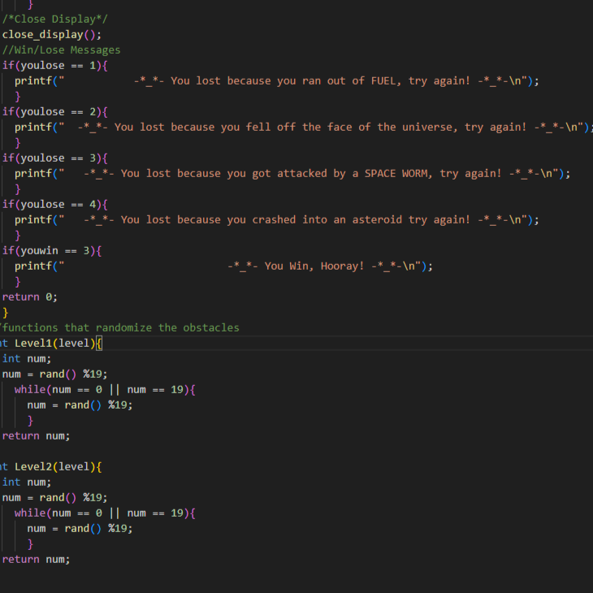
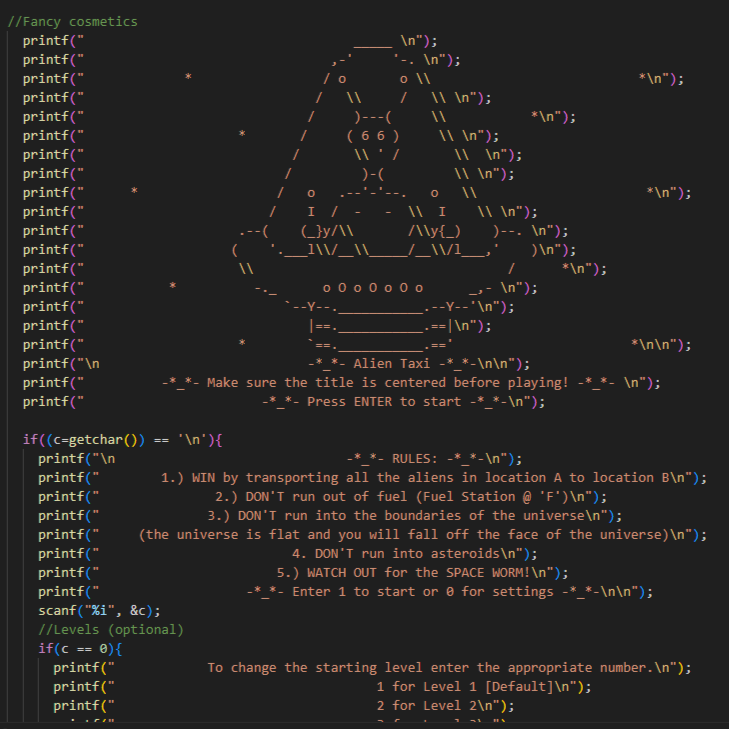

<div class="text-center p-4">
  
  
</div>

Alien Taxi is a 2-D space themed game were a player transports Alien passengers from one point to another. The game is played on a 20 by 20 grid of cells that may contain obstacles, nothing, or Fuel stops. The game has 3 difficulty levels and ends when the player transports 3 passengers. 

The mice are completely autonomous robots that must find their way from a predetermined starting position to the central area of the maze unaided.  The mouse will need to keep track of where it is, discover walls as it explores, map out the maze and detect when it has reached the center.  having reached the center, the mouse will typically perform additional searches of the maze until it has found the most optimal route from the start to the center.  Once the most optimal route has been determined, the mouse will run that route in the shortest possible time.

For this project, I was the lead programmer who was responsible for programming the various capabilities of the mouse.  I started by programming the basics, such as sensor polling and motor actuation using interrupts.  From there, I then programmed the basic PD controls for the motors of the mouse.  The PD control the drive so that the mouse would stay centered while traversing the maze and keep the mouse driving straight.  I also programmed basic algorithms used to solve the maze such as a right wall hugger and a left wall hugger algorithm.  From there I worked on a flood-fill algorithm to help the mouse track where it is in the maze, and to map the route it takes.  We finished with the fastest mouse who finished the maze within our college.

Here is some code that shows how the obstacles were randomly generated every game:

```cpp
//functions that randomize the obstacles  
}
int Level2(level){
  int num;
  num = rand() %19;
    while(num == 0 || num == 19){
      num = rand() %19;
      }
  return num;
}
```

You can learn more at the [UH Micromouse News Announcement](https://manoa.hawaii.edu/news/article.php?aId=2857).
